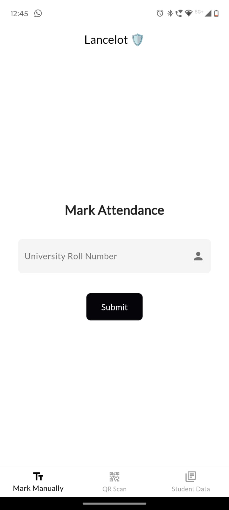
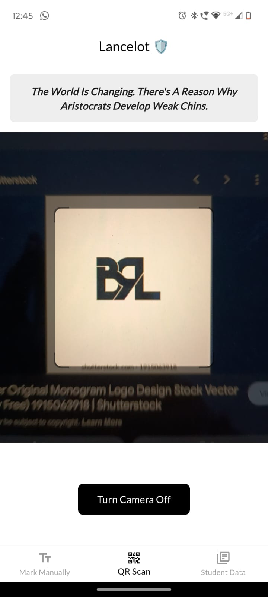
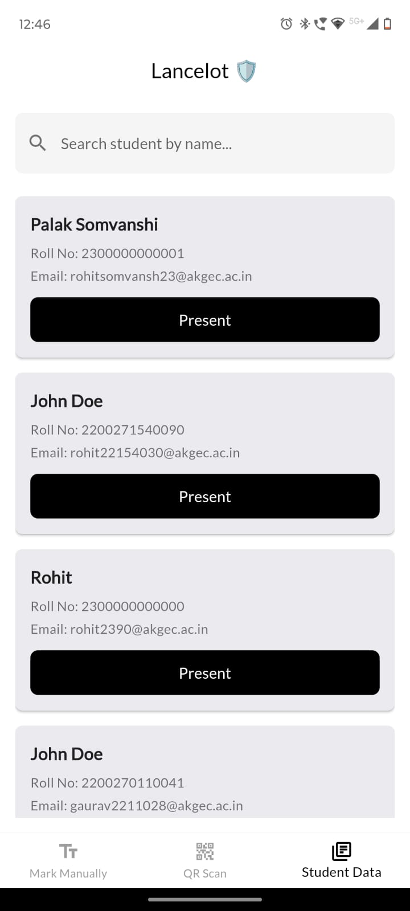

# Lancelot 🛡️

Welcome to **Lancelot**, the ultimate guardian of your attendance needs! 🏆 Whether you're marking attendance manually or through QR codes, Lancelot is here to ensure everything runs smoothly and efficiently. Let's dive into what makes Lancelot your knight in shining armor.

## 🛠️ Features

- **Manual Attendance:** Easily mark attendance using university roll numbers.
- **QR Code Scanning:** Quickly scan QR codes to mark attendance effortlessly.
- **Event Management:** Stay organized with our event management feature.

## 📸 Screenshots










## 📦 Installation

1. **Clone the Repository:**
   ```bash
   git clone https://github.com/Blockchain-Research-Lab/Lancelot.git
   ```

2. **Navigate to the Project Directory:**
   ```bash
   cd lancelot
   ```

3. **Install Dependencies:**
   ```bash
   flutter pub get
   ```

4. **Run the App:**
   ```bash
   flutter run
   ```

## 🔧 Configuration

Update your `config.dart` file to include your API base URL and any other configurations you need. Here’s a sample configuration:

```dart
class Config {
  static const String apiBaseUrl = 'https://api.example.com'; // Replace with your API base URL
}
```

## 🛡️ How It Works

1. **Mark Attendance Manually:** Enter the university roll number to mark attendance manually.
2. **Scan QR Codes:** Use your camera to scan QR codes and mark attendance with a quick scan.
3. **Event Management:** View and manage your events seamlessly with our intuitive interface.
4. **Student Data:** Access student data and attendance records with ease.

## 🏆 Why "Lancelot"?

Why the name "Lancelot"? 🛡️ Named after the legendary knight of the Round Table, Lancelot is designed to be your steadfast ally in managing and marking attendance. Just as Sir Lancelot was known for his honor and bravery, our app strives to bring efficiency and reliability to your attendance tracking needs.

## 📜 Contributing

We welcome contributions! If you have suggestions or improvements, please open an issue or submit a pull request.

## 📫 Contact

For any questions or support, reach out to us at [euclidstellar@gmail.com.com](mailto:euclidstellar@gmail.com).

## 🧑‍💻 License

This project is licensed under the MIT License - see the [LICENSE](LICENSE) file for details.

---

Thank you for choosing Lancelot! May your attendance tracking be as smooth as a knight's gallop. 🏇✨
